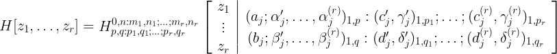
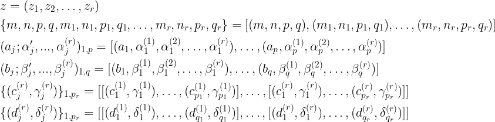

Este repositório contém uma implementação simples da função H de Fox multivariada em Python. A função H de Fox é uma função matemática multivariada que possui aplicações em diversas áreas, como teoria das probabilidades, processamento de sinais e análise estatística.

This repository contains a simple implementation of the multivariate Fox \(H\) function in Python. The Fox \(H\) function is a multivariate mathematical function with applications in various fields such as probability theory, signal processing, and statistical analysis.

 
#### Como Passar os Parâmetros para a Função

Para utilizar a função \(H\) de Fox no código fornecido, é necessário passar os parâmetros corretamente. A imagem abaixo demonstra como os parâmetros devem ser configurados e inseridos na função.

To use the Fox \(H\) function in the provided code, it's necessary to correctly pass the parameters. The image below demonstrates how the parameters should be configured and inserted into the function.

 

